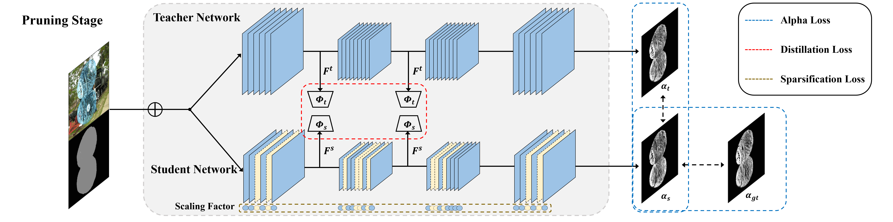
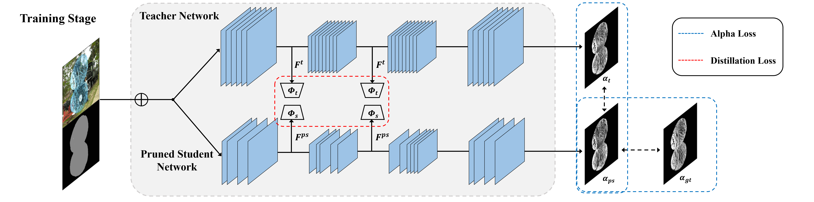

# Distillation-Based Channel Pruning

<p align=center>
  
  
</p>

  This repository is official pytorch implementation of the paper "[Lightweight Alpha Matting Network Using Distillation-Based Channel Pruning](https://arxiv.org/abs/2210.07760)" (ACCV 2022) which is a follow-up research of the paper of [SPKD](https://github.com/DongGeun-Yoon/SPKD) (IEEE SPL 2020).
 
 Donggeun Yoon, Jinsun Park, Donghyeon Cho
 
## Introduction
  We have proposed a distillation-based channel pruning method for lightening a deep image matting network. In the pruning step, we train a student network that has the same architecture with a teacher network using the distillation-based sparsification loss. Then, we train the pruned student network using the same distillation loss utilized in the pruning step. 

## Prepare
### Dataset
1. Please contact authors requesting for the Adobe Image Matting dataset.
2. Download images from the COCO and Pascal VOC datasets in folder `data` and Run the following command to composite images.  
```bash
$ python pre_process.py
```
3. Run the following command to seperate the composited datasets with training set and valid set.
```bash
$ python data_gen.py
```

### Pre-trained model
Download pretrained [teacher model](https://github.com/foamliu/Deep-Image-Matting-PyTorch) before train and place in folder `pretrained`.

## Pruning Stage
Our method consists of two stages: Pruning stage and Training Stage.
First, Run the following command to get pruned model suitable for SPKD. 

```bash
$ python train_prune.py --config configs/train_SPKD.yaml
```

## Training Stage
Second, Train pruned model. The model cfg is saved in `result/SPKD/pruned.tar`.
```bash
$ python train_pruned.py --config configs/train_SPKD.yaml
```

## Citation

```
@article{yoon2022lightweight,
  title={Lightweight Alpha Matting Network Using Distillation-Based Channel Pruning},
  author={Yoon, Donggeun and Park, Jinsun and Cho, Donghyeon},
  journal={arXiv preprint arXiv:2210.07760},
  year={2022}
}
```

## Acknowledgement
The code is built upon [Deep image matting (pytorch)](https://github.com/foamliu/Deep-Image-Matting-PyTorch).
